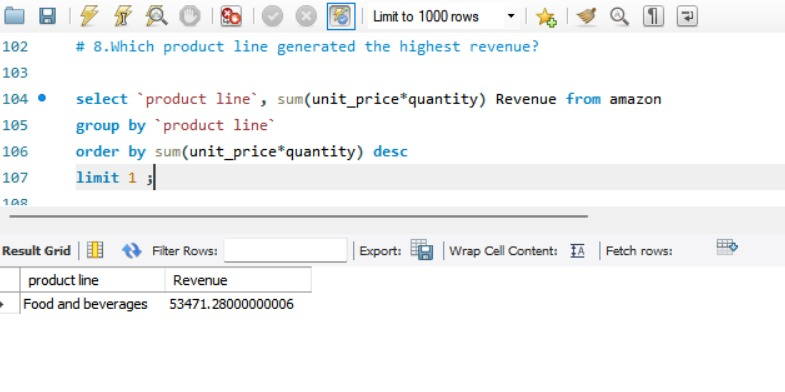
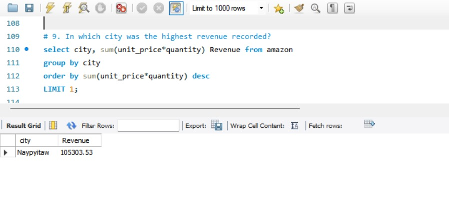
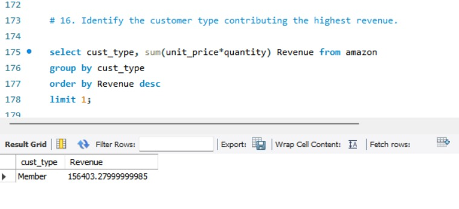
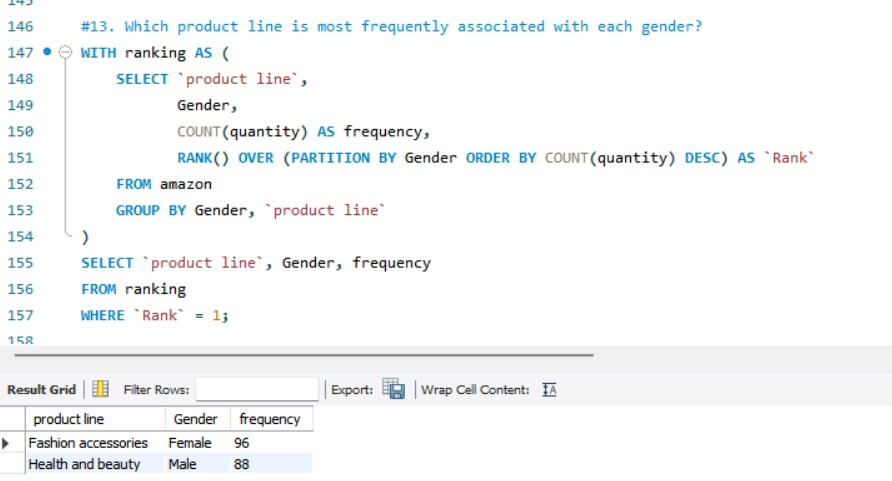
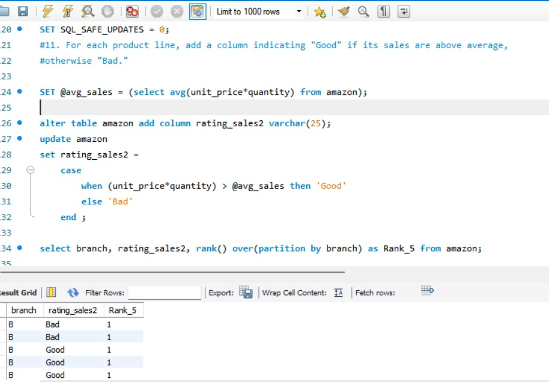

# 🛒 Amazon Sales Data Analysis (SQL Project)

This project showcases a comprehensive analysis of Amazon sales transaction data using **pure SQL**.  
It involves **data cleaning**, **feature engineering**, and **exploratory data analysis (EDA)** to uncover key insights into:

- Customer behavior
- Product performance
- Regional trends
- Revenue patterns
- Business improvement opportunities

---

## 🧩 Problem Statement

Amazon wants to better understand its transactional retail data to improve sales, customer retention, and operational efficiency.

The goal of this project is to use **SQL-only** techniques to:

- Create new features from the raw data
- Explore data patterns across cities, product lines, and customer segments
- Generate actionable business insights

---

## 📁 Dataset Description

- **Source**: Simulated Amazon retail sales data
- **Size**: 1,000+ rows, 17 columns
- **Key Fields**:
  - `Invoice ID`, `Branch`, `City`
  - `Customer Type` (Member / Normal), `Gender`
  - `Product Line`, `Unit Price`, `Quantity`, `Total`, `COGS`, `Tax5`
  - `Date`, `Time`, `Payment Method`
  - `Rating` (1 to 10 scale)

---

## 🛠️ Tools & Technologies

- **MySQL / SQL**
- SQL Features Used:
  - `GROUP BY`, `ORDER BY`, `CASE`, `RANK()`, `ROW_NUMBER()`, `CTEs`, `JOINs`, `Window Functions`
  - Data cleaning via `ALTER`, `UPDATE`, `IS NULL`, and transformations

---

## 🔧 Key Steps & Feature Engineering

### 🗂️ 1. Database & Table Setup
- Created and structured the `Amazon` database
- Cleaned column names for clarity
- Checked and handled missing/null data

### 🧠 2. Feature Engineering (Using SQL Only)

| Feature | Description |
|--------|-------------|
| `day_name` | Extracted from `Date` to identify weekday patterns |
| `month_name` | Extracted from `Date` for monthly analysis |
| `TimeOfDay` | Categorized time into Morning, Afternoon, Evening |
| `Rating_Sales` | Total sales per rating value |
| `Gross Margin` | Profit estimation via COGS and tax |
| `Weekend Flag` | Created to compare weekday vs weekend sales |

📷 **Feature Engineering Visual**:  

---

## 📊 Exploratory Data Analysis (EDA)

A series of SQL queries were executed to answer the following business questions:

---

### 🔹 1. Which product line generates the highest revenue?

``sql
SELECT Product Line, SUM(Unit_Price * Quantity) AS Total_Sales 
FROM Amazon
GROUP BY Product Line
ORDER BY Total_Sales DESC 
LIMIT 1;

 

📌 Insight: Food and Beverages generated the highest revenue, suggesting it’s a high-priority category for inventory and marketing.

### 🔹 2. Which city generates the highest revenue?

SELECT City, SUM(Unit_Price * Quantity) AS Revenue 
FROM Amazon
GROUP BY City
ORDER BY Revenue DESC 
LIMIT 1;

 

📌 Insight: Naypyitaw leads in total revenue — indicating potential for warehouse expansion and regional ad targeting.

### 🔹 3. Who are the top-performing customers by type?

SELECT Cust_Type, SUM(Unit_Price * Quantity) AS Revenue 

FROM Amazon

GROUP BY Cust_Type

ORDER BY Revenue DESC 

LIMIT 1;

 

📌 Insight: Members generate more sales, validating loyalty program success.

### 🔹 4. Which is/are the branch that exceeded average product sales? (SUBQUERY)

SELECT Branch, SUM(Quantity) AS Total_Products_Sold 

FROM Amazon
GROUP BY Branch
HAVING SUM(Quantity) > (SELECT AVG(Total_Products) 
                        FROM (SELECT SUM(Quantity) AS Total_Products FROM Amazon GROUP BY Branch) AS Avg_Table);

📊 Visual:

📌 Insight: 

### 🔹 5. What product lines are most preferred by gender? (With CTE)

WITH Ranking AS (
    SELECT Product Line, Gender, COUNT(Quantity) AS Frequency,
           RANK() OVER (PARTITION BY Gender ORDER BY COUNT(Quantity) DESC) AS Rank
    FROM Amazon
    GROUP BY Gender, Product Line
)
SELECT Product Line, Gender, Frequency 
FROM Ranking
WHERE Rank = 1;

 

📌 Insight:

Females prefer Fashion Accessories

Males prefer Health and beauty

### 🔹 6. Which day does each branch receive the best customer ratings?
WITH Rankings AS (
    SELECT Branch, DayName, AVG(Rating) AS Avg_Rating,
           RANK() OVER (PARTITION BY Branch ORDER BY AVG(Rating) DESC) AS Rank
    FROM Amazon
    GROUP BY Branch, DayName
)
SELECT Branch, DayName, Avg_Rating 
FROM Rankings
WHERE Rank = 1;

 

📌 Insight: Ratings vary across weekdays per branch — helpful for staffing and performance tracking.

### (FEATURE ENGINEERING)
### 🔹 7. For each product line, add a column indicating "Good" if its sales are above average, otherwise "Bad". 

SET @avg_sales = (SELECT AVG(Unit_Price * Quantity) FROM Amazon);

ALTER TABLE Amazon ADD COLUMN Rating_Sales2 VARCHAR(25);

UPDATE Amazon
SET Rating_Sales2 =  
    CASE
        WHEN (Unit_Price * Quantity) > @avg_sales THEN 'Good' 
        ELSE 'Bad' 
    END;

SELECT Branch, Rating_Sales2, 
        RANK() OVEER(PARTITION BY branch) Rank_5 
FROM Amazon;

📌 Insight: 

Branches mapped as per their performance and can be focused on such branches whose sales are lower.

## 🏆 Advanced Insights & Patterns

Gender-Based Product Preferences: Ranked using SQL RANK() and ROW_NUMBER()

Weekend vs Weekday Sales & Ratings: Derived using a computed weekend flag

Payment Preferences by Gender: Normalized trends

Time-based Performance: Morning vs Afternoon vs Evening

## 📌 Key Business Recommendations

Focus marketing on Food and Beverages in Naypyitaw

Promote Health & Beauty to female customers via targeted ads

Optimize staffing based on branch-wise peak rating days

Maintain and expand loyalty programs, as Members yield more revenue

Investigate COGS-heavy categories to maximize gross margin
